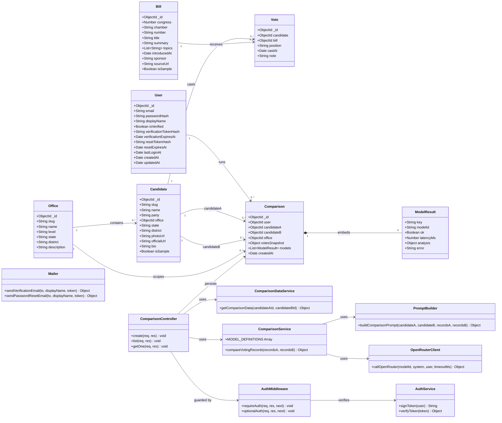

# Class Diagram — Record Over Rhetoric

Mongoose models, the service layer, and the Express request pipeline.

```mermaid
classDiagram
    direction LR

    class User {
        +ObjectId _id
        +String email
        +String passwordHash
        +String displayName
        +Boolean isVerified
        +String verificationTokenHash
        +Date verificationExpiresAt
        +String resetTokenHash
        +Date resetExpiresAt
        +Date lastLoginAt
        +Date createdAt
        +Date updatedAt
    }

    class Office {
        +ObjectId _id
        +String slug
        +String name
        +String level
        +String state
        +String district
        +String description
    }

    class Candidate {
        +ObjectId _id
        +String slug
        +String name
        +String party
        +ObjectId office
        +String state
        +String district
        +String photoUrl
        +String officialUrl
        +String bio
        +Boolean isSample
    }

    class Bill {
        +ObjectId _id
        +Number congress
        +String chamber
        +String number
        +String title
        +String summary
        +List~String~ topics
        +Date introducedAt
        +String sponsor
        +String sourceUrl
        +Boolean isSample
    }

    class Vote {
        +ObjectId _id
        +ObjectId candidate
        +ObjectId bill
        +String position
        +Date castAt
        +String note
    }

    class Comparison {
        +ObjectId _id
        +ObjectId user
        +ObjectId candidateA
        +ObjectId candidateB
        +ObjectId office
        +Object votesSnapshot
        +List~ModelResult~ models
        +Date createdAt
    }

    class ModelResult {
        +String key
        +String modelId
        +Boolean ok
        +Number latencyMs
        +Object analysis
        +String error
    }

    class AuthService {
        +signToken(user) String
        +verifyToken(token) Object
    }

    class ComparisonDataService {
        +getComparisonData(candidateAId, candidateBId) Object
    }

    class ComparisonService {
        +MODEL_DEFINITIONS Array
        +compareVotingRecords(recordsA, recordsB) Object
    }

    class PromptBuilder {
        +buildComparisonPrompt(candidateA, candidateB, recordsA, recordsB) Object
    }

    class OpenRouterClient {
        +callOpenRouter(modelId, system, user, timeoutMs) Object
    }

    class Mailer {
        +sendVerificationEmail(to, displayName, token) Object
        +sendPasswordResetEmail(to, displayName, token) Object
    }

    class ComparisonController {
        +create(req, res) void
        +list(req, res) void
        +getOne(req, res) void
    }

    class AuthMiddleware {
        +requireAuth(req, res, next) void
        +optionalAuth(req, res, next) void
    }

    Office "1" --> "0..*" Candidate : contains
    Candidate "1" --> "0..*" Vote : casts
    Bill "1" --> "0..*" Vote : receives
    User "1" --> "0..*" Comparison : runs
    Candidate "1" --> "0..*" Comparison : candidateA
    Candidate "1" --> "0..*" Comparison : candidateB
    Office "1" --> "0..*" Comparison : scopes
    Comparison "1" *-- "3" ModelResult : embeds

    ComparisonController --> ComparisonDataService : uses
    ComparisonController --> ComparisonService : uses
    ComparisonService --> PromptBuilder : uses
    ComparisonService --> OpenRouterClient : uses
    AuthMiddleware --> AuthService : verifies
    ComparisonController --> AuthMiddleware : guarded by
    ComparisonController --> Comparison : persists
```
