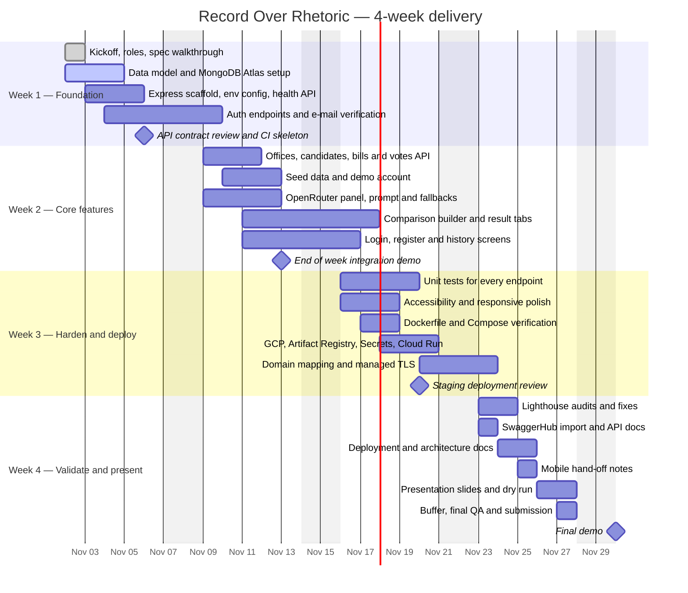

# Gantt Chart — Four-Week Schedule

A realistic four-week plan for a five-person student team, starting Monday
2 November 2026. Weekends are intentionally light; the final day is a buffer.

```mermaid
gantt
    title Record Over Rhetoric — 4-week delivery
    dateFormat YYYY-MM-DD
    axisFormat %b %d
    excludes weekends

    section Week 1 — Foundation
    Kickoff, roles, spec walkthrough           :done, w1a, 2026-11-02, 1d
    Data model and MongoDB Atlas setup        :active, w1b, 2026-11-02, 3d
    Express scaffold, env config, health API   :w1c, 2026-11-03, 3d
    Auth endpoints and e-mail verification     :w1d, 2026-11-04, 4d
    API contract review and CI skeleton        :milestone, m1, 2026-11-06, 0d

    section Week 2 — Core features
    Offices, candidates, bills and votes API   :w2a, 2026-11-09, 3d
    Seed data and demo account                 :w2b, 2026-11-10, 3d
    OpenRouter panel, prompt and fallbacks     :w2c, 2026-11-09, 4d
    Comparison builder and result tabs         :w2d, 2026-11-11, 5d
    Login, register and history screens        :w2e, 2026-11-11, 4d
    End of week integration demo               :milestone, m2, 2026-11-13, 0d

    section Week 3 — Harden and deploy
    Unit tests for every endpoint              :w3a, 2026-11-16, 4d
    Accessibility and responsive polish        :w3b, 2026-11-16, 3d
    Dockerfile and Compose verification        :w3c, 2026-11-17, 2d
    GCP, Artifact Registry, Secrets, Cloud Run :w3d, 2026-11-18, 3d
    Domain mapping and managed TLS             :w3e, 2026-11-20, 2d
    Staging deployment review                  :milestone, m3, 2026-11-20, 0d

    section Week 4 — Validate and present
    Lighthouse audits and fixes                :w4a, 2026-11-23, 2d
    SwaggerHub import and API docs             :w4b, 2026-11-23, 1d
    Deployment and architecture docs           :w4c, 2026-11-24, 2d
    Mobile hand-off notes                      :w4d, 2026-11-25, 1d
    Presentation slides and dry run            :w4e, 2026-11-26, 2d
    Buffer, final QA and submission            :w4f, 2026-11-27, 1d
    Final demo                                 :milestone, m4, 2026-11-30, 0d
```
