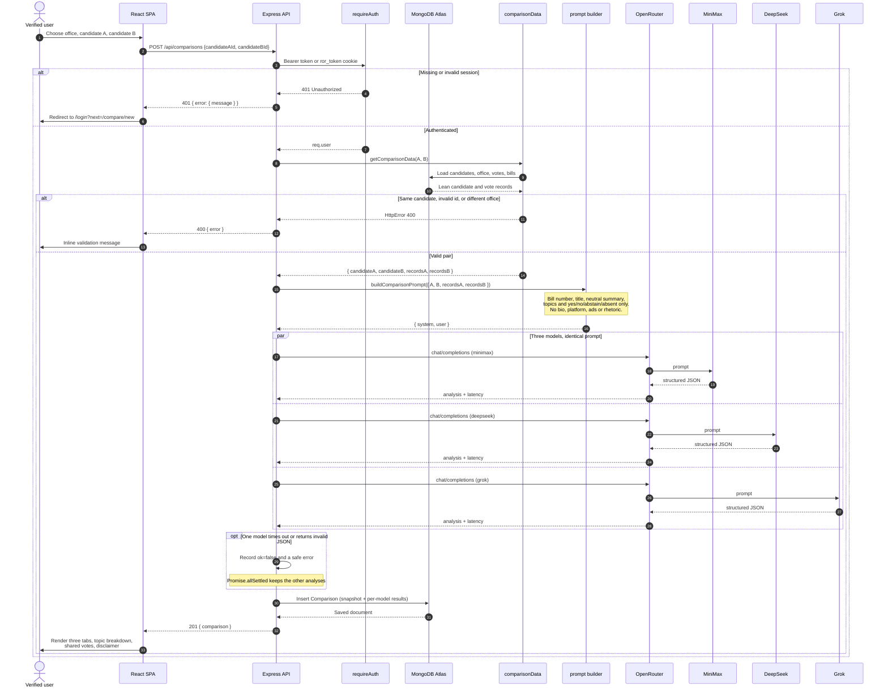

# Sequence Diagram — Comparison Flow

```mermaid
sequenceDiagram
    autonumber
    actor User as Verified user
    participant UI as React SPA
    participant API as Express API
    participant Auth as requireAuth
    participant DB as MongoDB Atlas
    participant Data as comparisonData
    participant Prompt as prompt builder
    participant OR as OpenRouter
    participant M1 as MiniMax
    participant M2 as DeepSeek
    participant M3 as Grok

    User->>UI: Choose office, candidate A, candidate B
    UI->>API: POST /api/comparisons {candidateAId, candidateBId}
    API->>Auth: Bearer token or ror_token cookie

    alt Missing or invalid session
        Auth-->>API: 401 Unauthorized
        API-->>UI: 401 { error: { message } }
        UI->>User: Redirect to /login?next=/compare/new
    else Authenticated
        Auth-->>API: req.user
        API->>Data: getComparisonData(A, B)
        Data->>DB: Load candidates, office, votes, bills
        DB-->>Data: Lean candidate and vote records

        alt Same candidate, invalid id, or different office
            Data-->>API: HttpError 400
            API-->>UI: 400 { error }
            UI->>User: Inline validation message
        else Valid pair
            Data-->>API: { candidateA, candidateB, recordsA, recordsB }
            API->>Prompt: buildComparisonPrompt({ A, B, recordsA, recordsB })
            Note over Prompt: Bill number, title, neutral summary,<br/>topics and yes/no/abstain/absent only.<br/>No bio, platform, ads or rhetoric.
            Prompt-->>API: { system, user }

            par Three models, identical prompt
                API->>OR: chat/completions (minimax)
                OR->>M1: prompt
                M1-->>OR: structured JSON
                OR-->>API: analysis + latency
            and
                API->>OR: chat/completions (deepseek)
                OR->>M2: prompt
                M2-->>OR: structured JSON
                OR-->>API: analysis + latency
            and
                API->>OR: chat/completions (grok)
                OR->>M3: prompt
                M3-->>OR: structured JSON
                OR-->>API: analysis + latency
            end

            opt One model times out or returns invalid JSON
                API->>API: Record ok=false and a safe error
                Note over API: Promise.allSettled keeps the other analyses
            end

            API->>DB: Insert Comparison (snapshot + per-model results)
            DB-->>API: Saved document
            API-->>UI: 201 { comparison }
            UI->>User: Render three tabs, topic breakdown,<br/>shared votes, disclaimer
        end
    end
```
